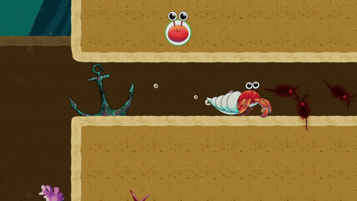
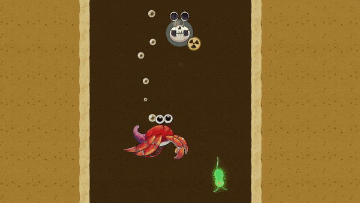
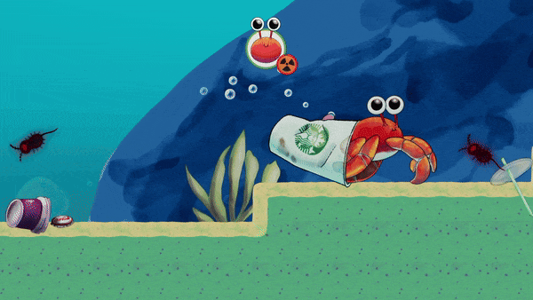

<p align="center"> 
  
</p>

[](https://javier-games.itch.io/crabbing-for-home)
[](https://v3.globalgamejam.org/2019/games/crabbing-home)
[](https://forums.unrealengine.com/t/crabbing-for-home-ggj-2019-port/122488)

# Crabbing for Home

In the post-apocalyptic depths of the ocean, a humble hermit crab has been tragically mutated by radioactive waste.
As it grows bigger, its fragile shell shatters, leaving it vulnerable in the contaminated waters. In Crabbing for Home,
you must help this little crab find new, stronger shells to protect itself as it strives to survive in a world turned 
upside down.

# Development

Created within 48 hours as part of the [Global Game Jam 2019](https://v3.globalgamejam.org/2019/games/crabbing-home) 
with the collaboration of a passionate team, this game incorporates the following diversifiers.

* **Language-Independence** (Sponsored by Valve Software): Universal design ensures everyone can play, no matter their language.
* **Bolter is Jammed!**: Due it circumstances hermit is making the best out of imperfect or unreliable resources to make them their new home.
* **Protect the Oceans**: Let's protect the onceans, the world is our home.

<p align="center"> 
  
</p>

## Credits

* Music: **Yahel Felipe**
* Art and Design: **Daniel Farrera**, **Gaby Morales**
* Programming: **David Castella**, **Diego Cuellar**, **Javier García**

## Features

### Radiation Growing

The ocean's radioactive contamination has caused Hermit to grow unpredictably. As Hermit increases in size,
its current shell may no longer be strong enough to accommodate the growth. When this happens, the shell shatters, 
leaving Hermit vulnerable. You must quickly find a new, sturdier shell to protect Hermit before it becomes exposed
to the deadly environment.

<p align="center"> 
  
</p>

### Timed Life and Radiation

Survival in this harsh world is a constant race against time. Hermit has two timers working against it and eating
plankton could affect its radiation for bad or for good.

* **Life Timer**: If Hermit stays outside a shell for too long, it will succumb to the toxic environment.
* **Radiation Timer**: Radiation continuously interferes with Hermit's ability to maintain a home, putting additional pressure on you to find a safe shelter before it’s too late.


<p align="center"> 
  
</p>

### Pick Up and Drop Down Shell
Hermit can pick up and drop shells at will. When outside a shell, Hermit moves faster and gains the ability to 
jump, giving it greater mobility. However, being without a shell comes at the cost of vulnerability—Hermit must find 
a new home quickly to avoid perishing.


<p align="center"> 
  
</p>

# Requirements

- [Unity 2021.1.23f1](https://unity.com/releases/editor/whats-new/2021.1.23#notes).

> This project was originally created using the Unity version [2018.3.3f1](https://unity.com/releases/editor/whats-new/2018.3.3#notes)
> and in order to make it accessible to newer versions was updated in 2021 to the [2021.1.23f1](https://unity.com/releases/editor/whats-new/2021.1.23#notes)
> version.

# Project Installation

To set up and run the Crabbing for Home, follow these steps:

1. Open your terminal or command prompt.
2. Clone the repository using the following command:
    ```bash 
    git clone https://github.com/javier-games/jam-crabbing-for-home.git 
    ``` 
3. Open the project.
4. Select the `Main` scene.

# Game Installation

1. Download the installer for Mac or Windows from the [itch.io](https://javier-games.itch.io/crabbing-for-home) official site.
2. Once the download is complete, open the installer file.
3. Follow the on-screen instructions to install Crabbing for Home on your computer.
4. After installation is complete, launch the game.
5. Enjoy playing!

# License

This project is licensed under the GNU General Public License v3.0. See the [LICENSE](LICENSE.txt) file for details. 
